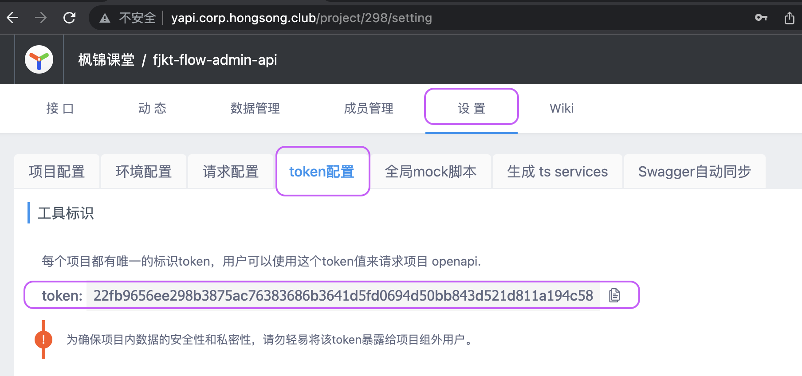
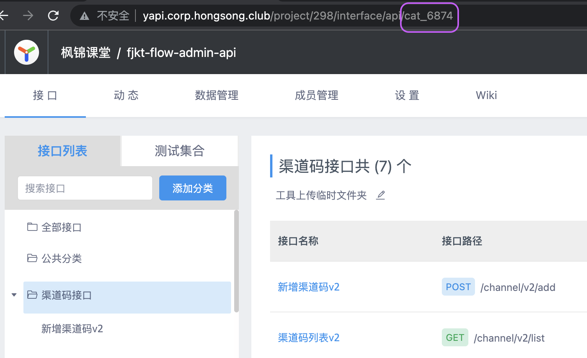

# WALL-E

一个自动生成 TypeScript API 的工具，目前支持 YAPI 和 Swagger。
名字源于一部动画电影的主人公——[机器人总动员 WALL-E](https://movie.douban.com/subject/2131459/)。

## 安装

```bash
yarn add -D @hs/hs-fe-walle
```

## 使用
在 `package.json` 中添加如下 scripts：

```json
"api:init": "walle init"
"api:gen": "walle gen"
```

- 执行 `yarn api:init` 初始化配置文件，将会生成 `walle.config.js` 文件
- 执行 `yarn api:gen` 生成 API 文件

## Config
相关配置都在 `walle.config.js` 文件中，一份可以正常使用配置如下：

```js
import { defineConfig } from "walle";

export default defineConfig({
  serverType: "yapi",
  serverUrl: "http://yapi.corp.hongsong.club/",
  projects: [
    {
      token: 'fea472ac89837c7d39c9910915838a83c8b7dcc72e05596ad5a3a44a4f3dadb6',
      gatewayPrefix: '/gateway/api/user',
      assignInterfaceProps: 'data',
      categories: [{ id: 7644, }],
    },
    {
      token: 'd93262cf7aa3bc578c090e52a3bb9b449075bf59c16a472875035e6dcf2bacb0',
      gatewayPrefix: '/gateway/api/fj-mkt',
      categories: [{ id: 7106 }],
    },
  ],
  outputFilePath: "./src/api",
  defaultRequestLib: false,
  topImportPkgTemplate: () => `import request from '@/services/HttpRequest';`,
});
```

### outputFilePath
输出文件路径

### defaultRequestLib
默认请求库，目前还不支持默认请求库，所以此配置应为 false，且需要设置 topImportPkgTemplate

### topImportPkgTemplate
自定义引入请求包的模板，如：`import request from '@/services/HttpRequest';`

### projects
- token，项目的 token
  
  
- gatewayPrefix，网关前缀，如：/gateway/api/user
- assignInterfaceProps，生成请求参数的数据属性，如某些接口后端定义了 `loginUserInfoDTO` 等字段，并不是业务调用方需要关心的，可以设置此配置
- categories
  - id，分类 ID，一般格式为 `cat_xxx`，这里需要的是 xxx
  
    

### serverType
服务类型，目前支持 yapi/swagger

### serverUrl
服务地址，此配置为默认配置，通常团队内部的服务地址是一致的，如果有特殊的，可以在项目中单独配置

## Development
[Development Doc](doc/development.md)
